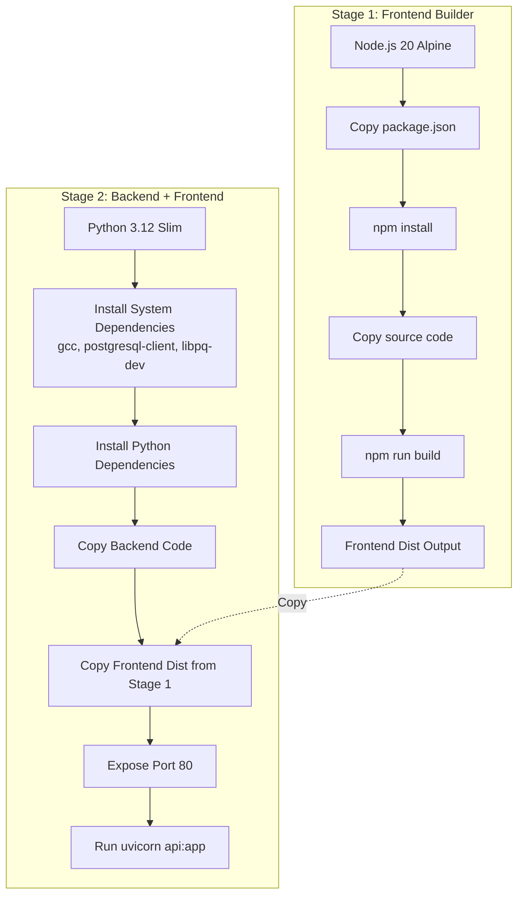
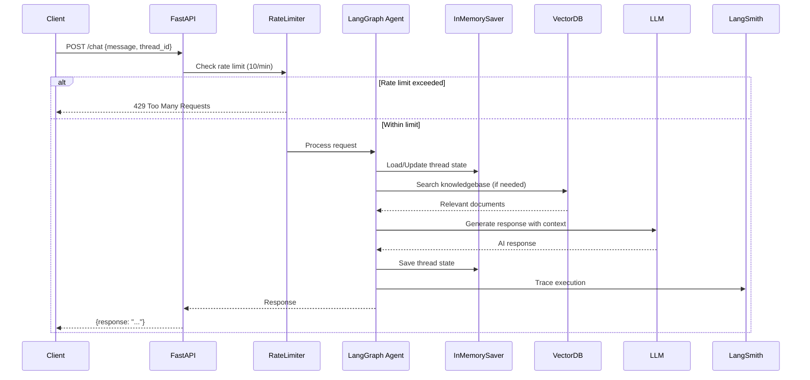
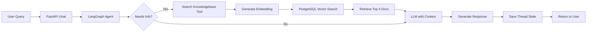

# Japan AI Chatbot - Architecture Documentation

## Overview

This document describes the architecture, deployment, and features of the Japan AI Chatbot application. The system is a full-stack AI chatbot that provides Japanese business subsidy information through a React frontend and FastAPI backend, containerized using Docker.

---

## 🏗️ Docker Deployment Architecture

### Multi-Stage Build Process



### Container Structure

```
┌─────────────────────────────────────────────────┐
│         Docker Container (Port 80)               │
├─────────────────────────────────────────────────┤
│  FastAPI Application (uvicorn)                   │
│  ├── /api/chat (POST)                           │
│  ├── / (GET) - Serve index.html                 │
│  ├── /assets/* (Static files)                   │
│  └── /docs (Auto-generated API docs)            │
│                                                  │
│  Static Files (React SPA)                       │
│  ├── index.html                                 │
│  └── assets/ (JS, CSS, images)                 │
│                                                  │
│  Python Dependencies                            │
│  ├── FastAPI, Uvicorn                           │
│  ├── LangChain, LangGraph                       │
│  ├── PostgreSQL Vector Store                    │
│  └── LLM Providers (Anthropic, Google)         │
└─────────────────────────────────────────────────┘
```

---

## 🔄 Application Architecture

### System Flow Diagram



---

## 🚀 FastAPI Application Features

### 1. Rate Limiting

**Implementation:** `slowapi` with per-IP rate limiting

- **Limit:** 10 requests per minute per IP address
- **Key Function:** `get_remote_address` (extracts client IP)
- **Error Handling:** Custom exception handler for `RateLimitExceeded`
- **Purpose:** Prevent API abuse and ensure fair resource usage

```python
@limiter.limit("10/minute")
async def chat_endpoint(request: Request, chat_request: chatRequest):
    # Endpoint logic
```

### 2. Thread-Wise Session Handling

**Implementation:** LangGraph `InMemorySaver` checkpointer

**How it works:**
- Each conversation thread has a unique `thread_id` (UUID)
- Thread ID is passed in request: `{"message": "...", "thread_id": "uuid"}`
- LangGraph agent maintains conversation state per thread
- State includes full message history and agent memory

**Key Components:**
- **Checkpointer:** `InMemorySaver()` - Stores conversation state in memory
- **Thread ID:** Auto-generated UUID if not provided in request
- **State Management:** Each thread maintains independent conversation context

```python
response = await agent.ainvoke(
    {"messages": [{"role": "user", "content": user_message}]},
    config={"configurable": {"thread_id": thread_id}},
)
```

**Benefits:**
- ✅ Multi-user support with isolated conversations
- ✅ Conversation continuity across requests
- ✅ Context preservation within threads
- ⚠️ **Note:** In-memory storage (lost on restart) - consider PostgreSQL checkpointer for production

### 3. CORS Middleware

**Configuration:**
- **Allow Origins:** `["*"]` (all origins)
- **Allow Methods:** GET, POST, PUT, DELETE, OPTIONS
- **Allow Headers:** `["*"]` (all headers)
- **Credentials:** Disabled (no cookies/auth headers)

**Purpose:** Enable cross-origin requests from web frontend

### 4. LangSmith Tracing & Observability

**Configuration:**
```python
os.environ["LANGSMITH_TRACING_V2"] = "true"
os.environ["LANGSMITH_ENDPOINT"] = "https://api.smith.langchain.com"
os.environ["LANGSMITH_PROJECT"] = "japan-ai"
```

**Features:**
- Automatic tracing of all LangChain/LangGraph operations
- Performance monitoring and debugging
- Request/response logging
- Tool usage tracking
- Cost tracking

### 5. Static File Serving (SPA Support)

**Routes:**
- `/` → Serves `index.html` (React app entry point)
- `/assets/*` → Serves static assets (JS, CSS, images)
- `/{full_path:path}` → Catch-all route for SPA routing (returns `index.html`)

**Implementation:**
- Uses `FastAPI.staticfiles.StaticFiles` for asset mounting
- `FileResponse` for serving HTML
- Excludes API routes (`/chat`) from SPA routing

### 6. Knowledge Base Search Tool

**Vector Database:** PostgreSQL with pgvector extension

**Flow:**
1. User query → Embedding generation (Google Gemini Embeddings)
2. Vector similarity search in PostgreSQL (`jp_ai_bot` table)
3. Retrieves top-k (k=4) most relevant documents
4. Documents passed to LLM as context

**Components:**
- **Embedding Model:** `gemini-embedding-001` (GoogleGenerativeAI)
- **Vector Size:** 3072 dimensions
- **Store:** `PGVectorStore` (langchain-postgres)
- **Tool:** `search_knowledgebase` async function

```python
@tool
async def search_knowledgebase(query: str) -> str:
    # Vector similarity search
    docs = await vector_store.asimilarity_search_by_vector(query_vector, k=4)
    return "\n\n".join(doc.page_content for doc in docs)
```

---

## 🧠 LLM & Agent Configuration

### LLM Model
- **Provider:** Anthropic
- **Model:** `claude-haiku-4-5-20251001`
- **Temperature:** 0.5 (balanced creativity/consistency)

### Agent Setup
```python
agent = create_agent(
    model=llm,
    tools=[search_knowledgebase],
    system_prompt=system_prompt,
    checkpointer=InMemorySaver(),
    name="Japan AI Agent",
)
```

**System Prompt:**
- Expert in Japanese language
- Answers in Japanese and English
- Always uses `search_knowledgebase` tool for accurate information
- Only skips tool for normal conversation

---

## 📊 Request/Response Flow

### API Endpoint: `POST /chat`

**Request:**
```json
{
  "message": "What subsidies are available for starting a business in Japan?",
  "thread_id": "550e8400-e29b-41d4-a716-446655440000"  // Optional
}
```

**Response:**
```json
{
  "response": "日本でビジネスを始めるための補助金について..."
}
```

**Process:**
1. Validate request (Pydantic model)
2. Check rate limit
3. Load thread state from checkpointer (if thread_id exists)
4. Agent processes message with tool access
5. Save updated thread state
6. Return response

---

## 🗄️ Data Flow



---

## 🔐 Security & Performance Features

### Security
- ✅ Rate limiting (DoS protection)
- ✅ CORS configuration
- ✅ Input validation (Pydantic models)
- ✅ Environment variable management (.env)

### Performance
- ✅ Async/await throughout (FastAPI async endpoints)
- ✅ Vector search optimization (top-k retrieval)
- ✅ In-memory checkpointer (fast state access)
- ⚠️ Consider PostgreSQL checkpointer for production persistence

---

## 📦 Dependencies

### Core Framework
- `fastapi` - Web framework
- `uvicorn` - ASGI server
- `pydantic` - Data validation

### AI/ML Stack
- `langchain==1.0.2` - LLM framework
- `langgraph==1.0.1` - Agent orchestration
- `langchain-google-genai==3.0.0` - Google embeddings
- `langchain-anthropic==1.0.1` - Anthropic LLM
- `langchain-postgres==0.0.16` - Vector database

### Database
- `psycopg2-binary` - PostgreSQL driver
- `supabase==2.22.2` - Database client

### Utilities
- `slowapi` - Rate limiting
- `python-dotenv` - Environment management
- `rich` - Logging/printing

---

## 🚀 Deployment

### Build Command
```bash
docker build -t jp-bot .
```

### Run Command
```bash
docker run -d -p 80:80 --name jp-bot-container jp-bot
```

### Environment Variables Required
- `ANTHROPIC_API_KEY` - For Claude LLM
- `GOOGLE_API_KEY` - For embeddings
- `LANGCHAIN_API_KEY` - For LangSmith tracing
- `db_user`, `db_password`, `db_host`, `db_port`, `db_name` - PostgreSQL connection

---

## 📝 Notes

### Current Limitations
1. **In-Memory Checkpointer:** Thread state lost on server restart
   - **Recommendation:** Use `PostgreSQLCheckpointer` for production
2. **Rate Limiting:** Per-IP basis (can be bypassed with proxies)
   - **Recommendation:** Add authentication for stricter limits
3. **CORS:** Currently allows all origins (`*`)
   - **Recommendation:** Restrict to specific frontend domains in production

### Production Considerations
- Add authentication/authorization
- Implement persistent checkpointer (PostgreSQL)
- Add request logging and monitoring
- Set up health check endpoints
- Configure proper CORS origins
- Add database connection pooling
- Implement retry logic for external API calls
- Add structured logging (e.g., JSON logs)

---

## 🔗 Related Components

### Subsidy Chatbot (Flask App)
A separate Flask application (`subsidy_chatbot/`) that acts as a proxy to this FastAPI service:
- Flask frontend with templates
- Proxies requests to FastAPI `/chat` endpoint
- Manages thread_id generation and session management
- Supports Japanese/English bilingual interface

---

## 📚 API Documentation

FastAPI automatically generates interactive API documentation:
- **Swagger UI:** `http://your-server/docs`
- **ReDoc:** `http://your-server/redoc`

---

*Last Updated: 2025*
